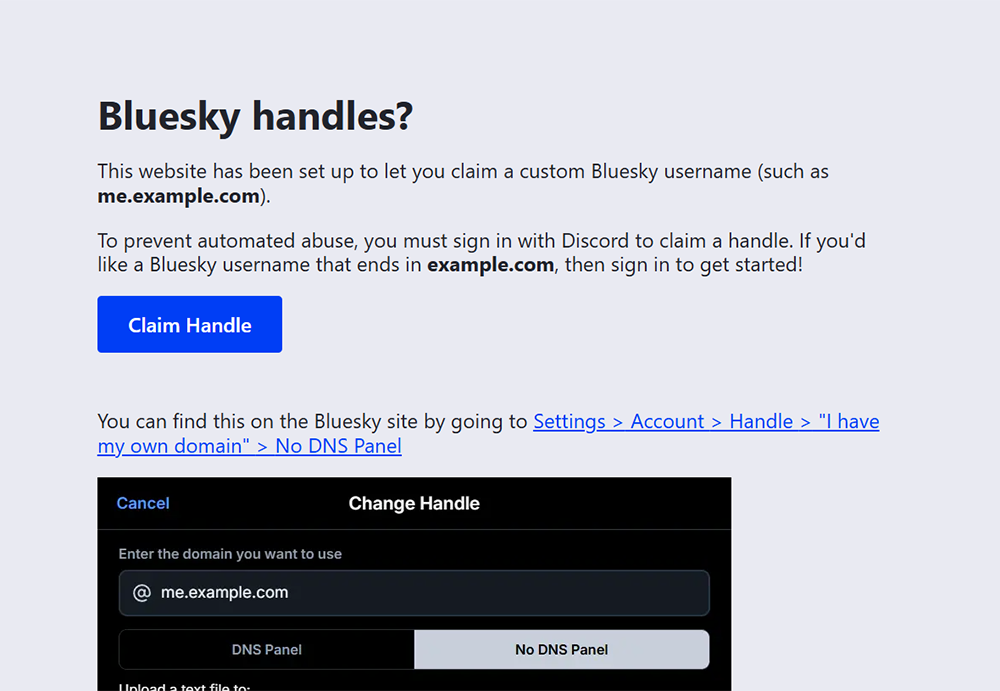
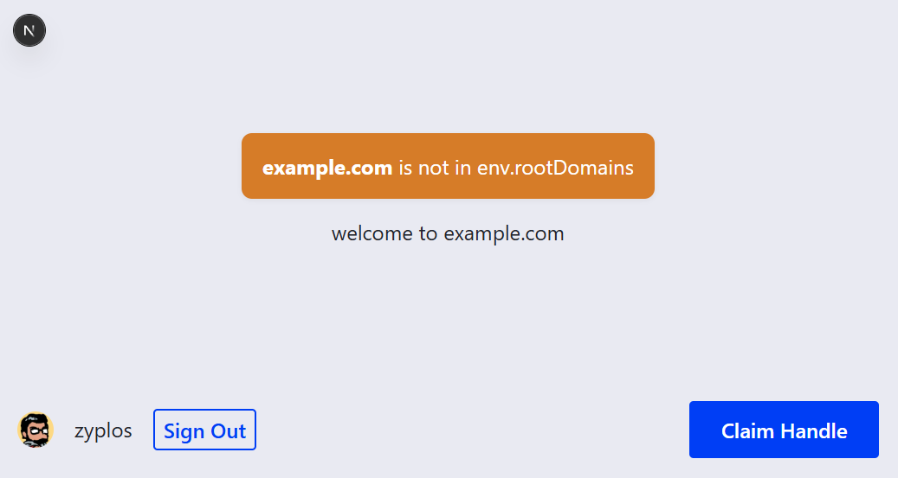

# bluesky-handles-kiosk

**bluesky-handles-kiosk** is a Next.js project that lets users claim Bluesky handles under a domain. This project is meant to be deployed on any domains you might have lying around that are going unused, but might make for a good Bluesky handle. Users sign in with Discord to claim a handle.

Made with Next.js with Auth.js for user sign ins and PostgreSQL to store user data. Meant to be deployed on Vercel for easy setup.




## Project Setup

If you'd like to setup this project for your own domain, please take a look at [the wiki's Project Setup page](https://github.com/zyplos/bluesky-handles-kiosk/wiki/Project-Setup) for a step by step guide.


## Development Setup

To work on this project locally, you'll need a PostgreSQL server already set up and an application made in the [Discord Developer Portal](https://discord.com/developers/applications). Once you're ready, clone this repo and install the required dependencies:

```bash
# clone repo
git clone https://github.com/zyplos/bluesky-handles-kiosk.git

# install dependencies
bun install
```

Copy the `.env.example` file and rename it to `.env` before running the project. Fill out the required fields with things from your PostgreSQL server and Discord OAuth application. If you need a guide for these steps, refer to [the Project Setup wiki page](https://github.com/zyplos/bluesky-handles-kiosk/wiki/Project-Setup).

Once you're done with the `.env` files, you can run the project locally:

```bash
# run the development server
bun dev
```

Open [http://localhost:3000](http://localhost:3000) in your browser. Edit `./app/page.tsx` and save to see the changes automatically reflected in your browser.

This is a [Next.js](https://nextjs.org) project that was meant to be deployed on Vercel. For development purposes, while you're on `localhost`, you can freely visit any of the pages in `./app/hostnameSpecific/[rootDomain]` and put in any string for the hostname. In a production environment, users will be redirected to `/` so they cannot claim handles under any arbitrary hostname.



Redirects may not work in your local development environment. You can manually visit the about, claim, and did resolver pages with these urls:

- `https://localhost:3000/hostnameSpecific/<your domain>/handles` - the about page
- `https://localhost:3000/hostnameSpecific/<your domain>/claim` - the page with the form to let users claim a handle
- `https://localhost:3000/hostnameSpecific/<your domain>/didResolver/<handle>` - the page that responds to requests for "https://<handle.domain_bluesky_looks_at>/.well-known/atproto-did"

Please refer to [`./middleware.ts`](https://github.com/zyplos/bluesky-handles-kiosk/blob/main/middleware.ts) to see how requests are rewritten.

This project supports handling requests from multiple domains. If you'd like to customize the look and content of a specific domain, visit [the Customization wiki page](https://github.com/zyplos/bluesky-handles-kiosk/wiki/Customization) for more information.